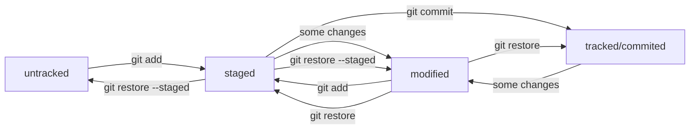

# Git Cheat Sheet
This repository is for refreshing your memory about Git.

Git is a _Global Information Tracker_ or _Goddamn Idiotic Truckload of sh*t_, depends on your mood.

---

## Basic CLI
### Commands:
```bash
pwd  # print working directory
```
```bash
cd  # change directory
```
```bash
ls  # list directory contents
```
```bash
ls -a  # all
```
```bash
ls -l  # long
```
```bash
ls -la  # all + long
```
```bash
touch <file_name>  # create a file; one or more
```
```bash
mkdir <dir_name>  # create a dir
```
```bash
mkdir -p  # create dirs
```
```bash
cp <file_or_dir>  # copy one or more
```
```bash
mv <file_or_dir>  # move one or more
```
```bash
cat <file>  # concatenate and print
```
```bash
rm <file>  # remove a file
```
```bash
rm -rf <not_empty_dir>  # remove a not empty dir; r - recursive; f - force
```
```bash
rmdir <empty_dir>  # remove an empty dir
```

### Symbols:
- **.** - *current directory*
- **..** - *parent directory*
- **~** - *home directory (tilda)*
- **/** - *root directory*

### Make Your Work Faster:
- **&&** - *run more than one cmd (double ampersand)*
- **↑ ↓** - *teminal memory AKA buffer*
- **Tab** - *autocomplete*

---

## First Steps With Git
### Installing
```bash
sudo apt-get update && sudo apt-get install git-all
git version
```

### Setting Up
Write who are you:
```bash
git config --global user.name "User Namonich"
git config --global user.email username@yandex.ru
```

Two ways to check configuration:
```bash
cat ~/.gitconfig
git config --list
```

### Basic Workflow
```bash
git init  # create repo
```
```bash
rm -rf .git  # remove repo
```
```bash
git status  # check state of the repo
```
```bash
git add  # add file(s) to index; --all - all files; . - all files from current dir
```
```bash
git commit  # create commit with redactor to make comment
```
```bash
git commit -m 'Initial commit'  # create commit with message
```
```bash
git log  # check history (output is in desc order by default); --reverse - asc order; --oneline - short way
```

### Synchronization
(repositories and branches)  

Check if the keys already exist:
```bash
cd ~
ls -la ~/.ssh
```

Instuction to generate SSH keys:
```bash
ssh-keygen -t ed25519 -C 'email address associated with your GitHub'
```
If the algorithm is not supported:
```bash
ssh-keygen -t rsa -b 4096 -C 'email address associated with your GitHub'
```

Is everything ok?
```bash
ssh -T git@github.com
```

Synchronizing a local Git repository with a remote one:
```bash
git remote add origin <url>
git remote -v
```

First push:
```bash
git push -u origin main  # after you should write just `git push`
```

### States
File/git status:
- untracked/untracked files
- tracked
- staged (staging area, index, cash)/changes to be commited
- modified/changes not staged for commit

Roadmap:


**Git file lifecycle**:


### Commit Styles
- corporate `<jira_task_id>: <message>`
- conventional commits `<type>: <message>`
- GitHub-style `Fix <task_num>, <message>`

[More info about Conventional Commits](https://www.conventionalcommits.org/en/v1.0.0-beta.4/#%D1%81%D0%BF%D0%B5%D1%86%D0%B8%D1%84%D0%B8%D0%BA%D0%B0%D1%86%D0%B8%D1%8F "Conventional Commits")

### Change Last Commit
```bash
git commit --amend --no-edit  # without comment changing
git commit --amend -m  # change comment in the last commit
```

### Rollback
To unstage:
```bash
git restore --staged <file>  # one file
git restore --staged .  # all files
```

For commits:
```bash
git log --oneline  # to check hash
git reset --hard <commit_hash>  # to rollback
```

**Rollback-schema** with `git reset --hard`:


*Be careful with git reset --hard command, you can lose some important information!*

Rollback files that were modified by accident:
```bash
git restore <file>
```
